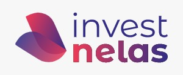

<h1 align="center">
    
</h1>

  

  
  
  
  
  

<h3 align="center"> A InvestNelas é um aplicativo que conecta empreendedoras com possíveis investidores. Em nossa plataforma, a usuária passará por uma análise, detalhando seu negócio. A proposta é será avaliada e, se necessário, temos a trilha de conhecimento, local para capacitar mulheres no âmbito profissional e pessoal. Com a proposta alinhada, a usuária estará pronta para apresentar seu pitch e buscar por investidores. Assim, aquele que se interessar por algum projeto, poderá financiar a ideia. Nosso diferencial é ser um ambiente de conexão empreendedora-investidor e fornecer uma capacitação especializada. </h3>

<h3 align="center"> React Native </h3>

 Using the power of a powerful stack, using a single popular and modern language, JavaScript.   Lean productivity and performance. 

---

## Technologies

<ul>
    <li><a href="https://reactnative.dev/">React Native</a></li>
</ul>

## Tools

<ul>
    <li><a href="https://www.npmjs.com/package/nodemon">Nodemon</a></li>
    <li><a href="https://www.npmjs.com/package/axios">Axios</a></li>
    <li><a href="https://www.npmjs.com/package/cors">Cors</a></li>
    <li><a href="https://github.com/arb/celebrate">Celebrate</a></li>
    <li><a href="http://knexjs.org/">Knex</a></li>
    <li><a href="https://expo.io/">Expo</a></li>
</ul>

## Screens

## License
This project is under the MIT license. See the [LICENSE](LICENSE.md) for details.

---

Made with ❤️ by <strong>Anna Flávia Castro

